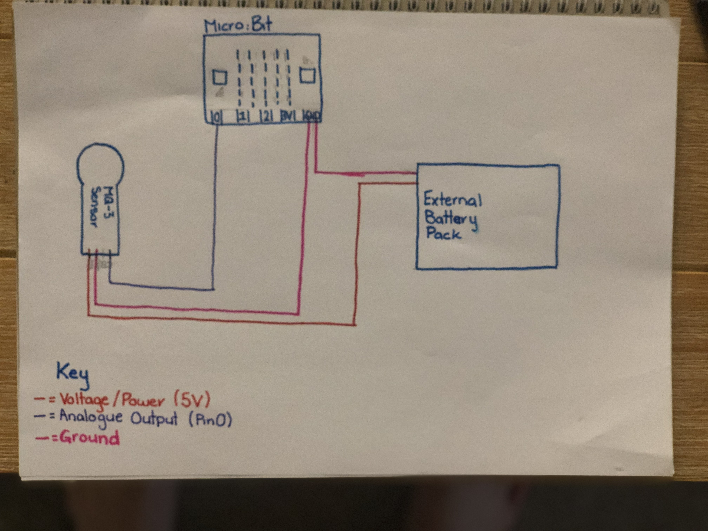
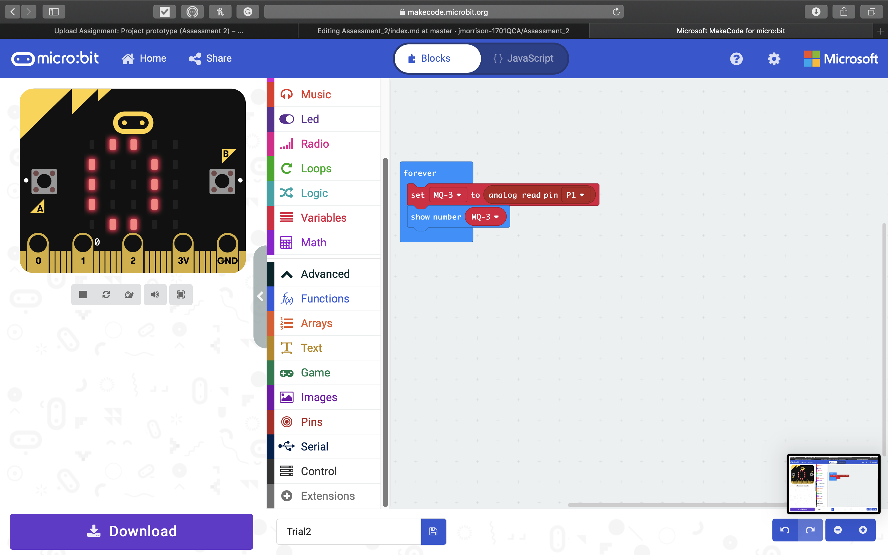
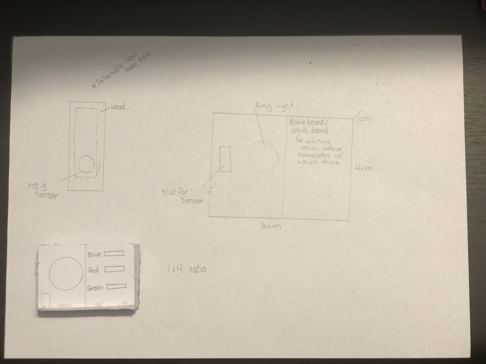

# 1701QCA Final project journal: *Jessica Morrison*

<!--- As for other assessments, fill out the following journal sections with information relevant to your project. --->

<!--- Markdown reference: https://guides.github.com/features/mastering-markdown/ --->

## Related projects ##

### MQ-3 Arduino Alcohol Sensor ###

https://www.instructables.com/id/MQ-3-Arduino-Alcohol-Sensor/

The alcohol sensor project is using the same type of alcohol sesnor that is required for my design. This project helps me to understand how the to connect the MQ-3 to the micro:Bit. This project was used to help me understand the basics of the MQ-3 sensor and helped me get a better grasp on how to code with it.

### AAn alcohol tester with LED lights made with Zerynth ###

https://create.arduino.cc/projecthub/framan/an-alcohol-tester-with-led-lights-made-with-zerynth-fc9d9e?ref=search&ref_id=Alcohol%20sensor&offset=2

This project is similar to mine as it uses an MQ-3 Alcohol Sensor and connects it to sereis of LED lights. This has a similar design as to what I want to complete just with a alternative purpose. From this project was the basis of my idea of using LED lights, and helped me understand how to code them to react with the MQ-3 Acohol sensor.

### Arduino Alcohol Detector | MQ-3 Sensor ###

https://www.viralsciencecreativity.com/post/arduino-alcohol-detector-mq-3-sensor

The Arduino Alcohol Detector | MQ-3 Sensor project uses a MQ-3 Sensor and when over the set limiot the buzzer will go off. This is related to my project as it has the basis of when a certain B.A.C limit is reached it casues a reaction from an external device. This design allows me to veiw the etireity of the process that was required to make this and allows me to veiw the code.

### RING PONG ###

https://create.arduino.cc/projecthub/aerodynamics/ring-pong-b91a4f?ref=search&ref_id=RGB%20Ring&offset=0

This project created a game using the RGB Ring LED. This project is related to mie as it uses a RGB Ring LED which is what intented to be used in my project. This design allows me to understand the programming aspect and how to connect the Ring Light onto the micro:Bit.

### Gyroscope Fun with NeoPixel Ring ###

https://create.arduino.cc/projecthub/danionescu/gyroscope-fun-with-neopixel-ring-3a0b84?ref=search&ref_id=RGB%20Ring&offset=9

The Gyroscope project is related to this project as it uses readings from an external component then uses this reading and causes it to have a reaction with the Ring Light. This allows me to understand how to correctly connect and external device correctly.

### NeoPixel Animation with Gestures ###

https://create.arduino.cc/projecthub/danionescu/neopixel-animation-with-gestures-6322bf?ref=search&ref_id=RGB%20Ring&offset=19

The Geopixel Animation design project has similar factors to the current project underway. The project uses the same RGB Ring Light, and has a similar function of using reading from an external device to cause an action with the Ring Light. This allows me to understand the more complexe coding of the Ring light.

## Other research ##

### MQ-3 Alcohol Gas Sensor ###

https://components101.com/sensors/mq-3-alcohol-gas-sensor

This webpage was used to understand how to correctly wire the MQ-3 Sensor, and what each output on the sesnor is connected too.

### Learn Python - Full Course for Beginners [Tutorial] ###

https://www.youtube.com/watch?v=rfscVS0vtbw

This video was used to help learning how to program in python.

### Using an 24 Bit RGB Neopixel LCD Ring with Arduino ###

https://www.youtube.com/watch?v=ep82zvielUE

This video was used in the process of lighting up the RGB Ring Light as to understand the fundamental basics of operating the device.

## Conceptual development ##

### Design intent ###
<!--- Include your design intent here. It should be about a 10 word phrase/sentence. --->
To create a mature social game that allows players to interact using a sensor.

### Design ideation ###
<!--- Document your ideation process. This will include the design concepts presented for assessment 2. You can copy and paste that information here. --->
### Final Design Concept ###

A drinking game where each player breathes on an alcohol sensor, the sesnor then relays the level to a ring light that lights a certain colour (determined by the B.A.C) this colour determines what the strength of the next drink is.

This is a group game. At each turn the player uses the the Alcohol Sensor, once the level of B.A.C in their breath has been determined the player will drink the required drink and then complete a random activity (this can be determined by the colour or a alternative way). Once their turn is up the next player goes.

The type of alchol each colour represents is determined by the players, but the game is designed that as the B.A.C increases the Alcohol Content in the drink selected will decrease. 

This game will be using a MQ-3 Alcohol Sensor and 24 RGB LED Ring Module.

The game will be played off of a similar layout of a dartboard. This is so that the players can record what drinks each colour is for and for the activity points. This layout will also be a kind of box with a removable back, all the wires for this game will be run through the back of the board, this is due to the fact that this is a drinking game and if alcohol came in contact with the electronics the game would break. The removable back is so that the batteries are easily changed if they go flat.

### Final design concept ###
<!--- This should be a description of your concept including its context, motivation, or other relevant information you used to decide on this concept. --->
A drinking game where each player breathes on an alcohol sensor, the sesnor then relays the level to a ring light that lights a certain colour (determined by the B.A.C) this colour determines what the strength of the next drink is.

This is a group game. At each turn the player uses the the Alcohol Sensor, once the level of B.A.C in their breath has been determined the player will drink the required drink and then complete a random activity (this can be determined by the colour or a alternative way). Once their turn is up the next player goes.

The type of alchol each colour represents is determined by the players, but the game is designed that as the B.A.C increases the Alcohol Content in the drink selected will decrease. 

This game will be using a MQ-3 Alcohol Sensor and 24 RGB LED Ring Module.

The game will be played off of a similar layout of a dartboard. This is so that the players can record what drinks each colour is for and for the activity points. This layout will also be a kind of box with a removable back, all the wires for this game will be run through the back of the board, this is due to the fact that this is a drinking game and if alcohol came in contact with the electronics the game would break. The removable back is so that the batteries are easily changed if they go flat.

The motivation for this concept was the idea of creating a fun and intersting way to choose a playeers next drink it also creates a new game that can be personalised for each player.

### Interaction flowchart ###
<!--- Include an interaction flowchart of the interaction process in your project. Make sure you think about all the stages of interaction step-by-step. Also make sure that you consider actions a user might take that aren't what you intend in an ideal use case. Insert an image of it below. It might just be a photo of a hand-drawn sketch, not a carefully drawn digital diagram. It just needs to be legible. --->

## Process documentation ##
<!--- In this section, include text and images (and potentially links to video) that represent the development of your project including sources you've found (URLs and written references), choices you've made, sketches you've done, iterations completed, materials you've investigated, and code samples. Use the markdown reference for help in formatting the material.

### Technical Development ###
'The technical developemnt for this project has only just recently begun due to wait on essential components.

This is how the MQ-3 Alcohol sensor is going to be connected without using a breadboad, as it has been through the testing phases.

This is how the Alcohol sensor has been connected through the developmnt stages, this is allowing me to fix an errors that occur, so that the entirity of the project has to be restarted.

The basic code that is required to operate the Alcohol sensor so that when exposed the amount on the microbit increases. This is completed by using the anologue read pin.

### Fabrication ###

The fabrication for this project has been in development since its conception. It hasn't been altered much from the original design, only twice. Once for the practical manner for protecting the electronics and the other for the aesthtic purposes

This prototype is built to a scale of 1:4.

## Final code ##

<!--- Include here screenshots of the final code you used in the project if it is done with block coding. If you have used javascript, micropython, C, or other code, include it as text formatted as code using a series of three backticks ` before and after the code block. See https://guides.github.com/features/mastering-markdown/ for more information about that formatting. --->

## Design process discussion ##
<!--- Discuss your process used in this project, particularly with reference to aspects of the Double Diamond design methodology or other relevant design process. --->
When approaching a challenge in this task I refered to aspects of the double diamond method.

#### Challenges Thus far ####

Challenges that have presented themselves thus far is having to learn how to understand the MQ-3 tables so that the breathalyser can be callibrated. This process has yet to be completed and is currently in the define phase of learning and understanding the code used to create the callibration using Raspberry Pi. 

Another Challenge that has been completed was the wiring required to correclty connect the Breathyliser to the micro:Bit. This process reached completion. The method used to reach the outcome was the Double Diamond method also. The Discover phase was looking online at Git Hub and Audino at projects using the MQ-3 Alcohol Sensor, and seeing how they wired their projects together. The Define phase was understanding what each output and input on the MQ-3 was, this was completed by looking at designs of the product and how each version differentiates. The development phase was connecting all the wires and testing to see if this gave the correct reading, this was done by placing a bottle of vodka over the senor and seeing of the number that was presented on the micro:Bit LED's changed. 

The final challenge that has been presented thus far is the connecting of the 24 x RGB Ring Light to the Breathalyser. This task is in the development phase. The Disocover phase was looking at the problem and finding ways that a code can be changed so that instead of the number increasing on the LED screen on the micro:Bit the lights on the Ring change as well. The Define phase was used to cross reference other works on connecting an LED to a micro:Bit as an output.

### Fabrication ###

The fabrication for this project has just entered into the development phase where materials are being bought and assembled. To get to this phase the double diamond method was also used. I had wanted to make something portable and simplistic, as this was a drinking game i hadnt wanted the design to be too complex and also wanted it to have some style features. Originally it was going to be similar to a board game. It was made apparent that this was not appropiate for a game that involved liquids, it was also suggested that the nature of the game would make certain components difficult to remember as the game progressed this changed the external design of the board so that a white board could be incuded so these components could be easily seen and . 

#### Challenges Thus Far ####

A challenge that presented itself was due to the nature of the game involving liquid it was likly that the electronics on the project would get wet and as such the game would be destroyed this was corrected when I went to find ways to keep the electronics out oif the way of the alcohol. I looked at alternative materials and containers that would protect the electronics. In the end inspiraction was taken from a Dart board and the idea of having a woodern box, with all the wiring inside and a detachable back for access to the batteries.

## Reflection ##

<!--- Describe the parts of your project you felt were most successful and the parts that could have done with improvement, whether in terms of outcome, process, or understanding.

What techniques, approaches, skills, or information did you find useful from other sources (such as the related projects you identified earlier)?

What parts of your project do you feel are novel. This is IMPORTANT to help justify a key component of the assessment rubric.

What might be an interesting extension of this project? In what other contexts might this project be used? --->
