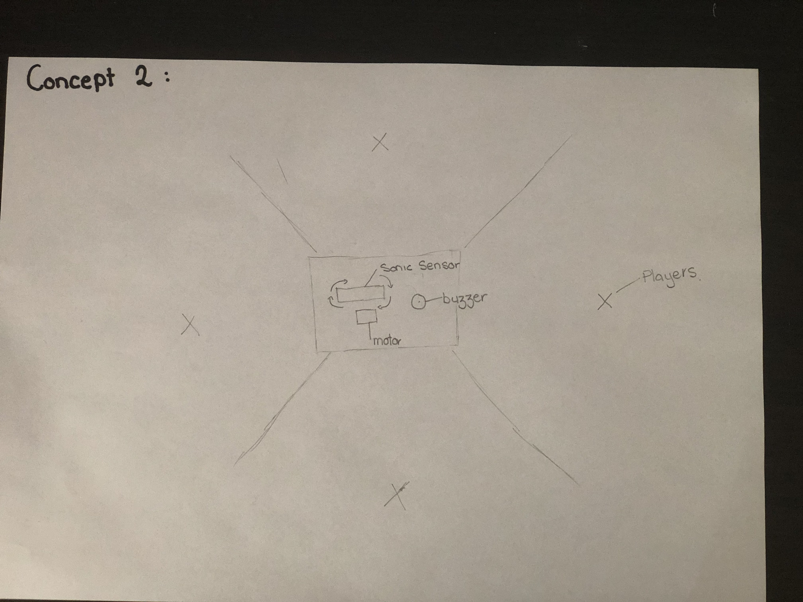
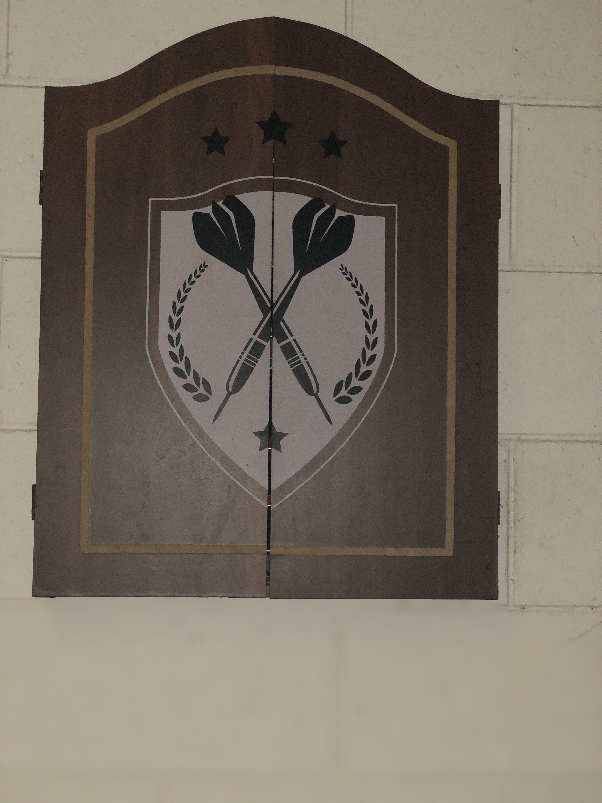
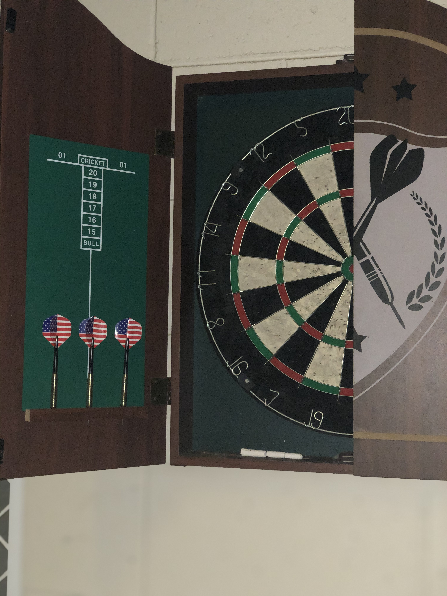
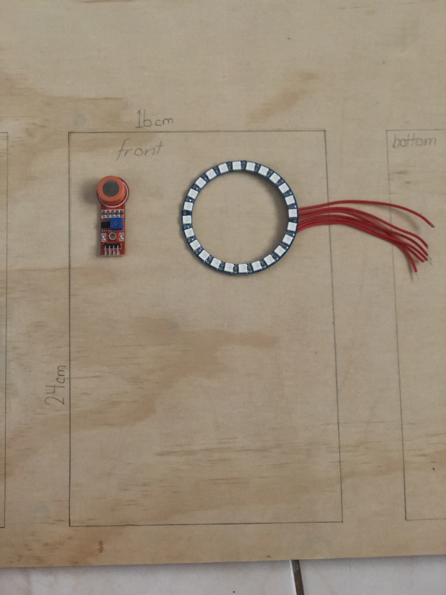
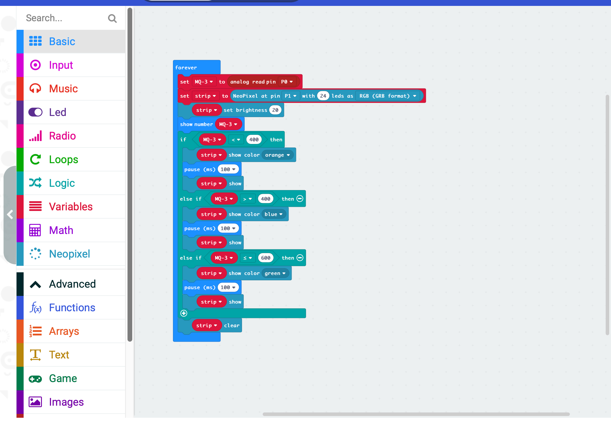

# 1701QCA Final project journal: *Jessica Morrison*

<!--- As for other assessments, fill out the following journal sections with information relevant to your project. --->

<!--- Markdown reference: https://guides.github.com/features/mastering-markdown/ --->

## Related projects ##

### MQ-3 Arduino Alcohol Sensor ###

https://www.instructables.com/id/MQ-3-Arduino-Alcohol-Sensor/

The alcohol sensor project is using the same type of alcohol sesnor that is required for my design. This project helps me to understand how the to connect the MQ-3 to the micro:Bit. This project was used to help me understand the basics of the MQ-3 sensor and helped me get a better grasp on how to code with it.

### AAn alcohol tester with LED lights made with Zerynth ###

https://create.arduino.cc/projecthub/framan/an-alcohol-tester-with-led-lights-made-with-zerynth-fc9d9e?ref=search&ref_id=Alcohol%20sensor&offset=2

This project is similar to mine as it uses an MQ-3 Alcohol Sensor and connects it to sereis of LED lights. This has a similar design as to what I want to complete just with a alternative purpose. From this project was the basis of my idea of using LED lights, and helped me understand how to code them to react with the MQ-3 Acohol sensor.

### Arduino Alcohol Detector | MQ-3 Sensor ###

https://www.viralsciencecreativity.com/post/arduino-alcohol-detector-mq-3-sensor

The Arduino Alcohol Detector | MQ-3 Sensor project uses a MQ-3 Sensor and when over the set limiot the buzzer will go off. This is related to my project as it has the basis of when a certain B.A.C limit is reached it casues a reaction from an external device. This design allows me to veiw the etireity of the process that was required to make this and allows me to veiw the code.

### RING PONG ###

https://create.arduino.cc/projecthub/aerodynamics/ring-pong-b91a4f?ref=search&ref_id=RGB%20Ring&offset=0

This project created a game using the RGB Ring LED. This project is related to mie as it uses a RGB Ring LED which is what intented to be used in my project. This design allows me to understand the programming aspect and how to connect the Ring Light onto the micro:Bit.

### Gyroscope Fun with NeoPixel Ring ###

https://create.arduino.cc/projecthub/danionescu/gyroscope-fun-with-neopixel-ring-3a0b84?ref=search&ref_id=RGB%20Ring&offset=9

The Gyroscope project is related to this project as it uses readings from an external component then uses this reading and causes it to have a reaction with the Ring Light. This allows me to understand how to correctly connect and external device correctly.

### NeoPixel Animation with Gestures ###

https://create.arduino.cc/projecthub/danionescu/neopixel-animation-with-gestures-6322bf?ref=search&ref_id=RGB%20Ring&offset=19

The Geopixel Animation design project has similar factors to the current project underway. The project uses the same RGB Ring Light, and has a similar function of using reading from an external device to cause an action with the Ring Light. This allows me to understand the more complexe coding of the Ring light.

## Other research ##

### MQ-3 Alcohol Gas Sensor ###

https://components101.com/sensors/mq-3-alcohol-gas-sensor

This webpage was used to understand how to correctly wire the MQ-3 Sensor, and what each output on the sesnor is connected too.

### Learn Python - Full Course for Beginners [Tutorial] ###

https://www.youtube.com/watch?v=rfscVS0vtbw

This video was used to help learning how to program in python.

### Using an 24 Bit RGB Neopixel LCD Ring with Arduino ###

https://www.youtube.com/watch?v=ep82zvielUE

This video was used in the process of lighting up the RGB Ring Light as to understand the fundamental basics of operating the device.

## Conceptual development ##

### Design intent ###
<!--- Include your design intent here. It should be about a 10 word phrase/sentence. --->
To create a mature social game that allows players to interact using a sensor.

### Design ideation ###
<!--- Document your ideation process. This will include the design concepts presented for assessment 2. You can copy and paste that information here. --->

#### Design Concept 1 ####

A game that uses a sonic sesnor that is connected to a series of LED Lights.

This game involves a series of players or a single player to approach the sensor and try to get the greatest amounts of points. The points are determined by what colour light is lit by the sensor. 

The sonic sensor would be set on a timer and every 20 seconds it would read where the player is and light up the equivilant light.

This would repeat with each player.

#### Design Concept 2 ####

A game that connects a movement sensor to a motor that rotates the sensor and when movement is detected a buzzer goes off.

This game can be played individually or with others.  The players are given a series of tasks (ie. twister, hopscotch, truth or dare etc.) and when the movement sensor is in their sector they all must freeze, no matter what position they are in. If the sensor detects movement the buzzer will sound and the team will either have a disadvantage next round or be out (it is ultimatley up to the players how they wish to use the equipment and what the rules are).

#### Final design concept ####
<!--- This should be a description of your concept including its context, motivation, or other relevant information you used to decide on this concept. --->

A drinking game where each player breathes on an alcohol sensor, the sesnor then relays the level to a ring light that lights a certain colour (determined by the B.A.C) this colour determines what the strength of the next drink is.

This is a group game. At each turn the player uses the the Alcohol Sensor, once the level of B.A.C in their breath has been determined the player will drink the required drink and then complete a random activity (this can be determined by the colour or a alternative way). Once their turn is up the next player goes.

The motivation behind this concept is to create a new and intersting game for adults to play of all ages, that is simple to use and understand. It also has to be a personable game that allows the players to make it there own, as this would allow them to enjoy it more rather then having a set of rules.

The game uses an MQ-3 sensor that reads the Alcohol Content that reading is then sent to the micro:Bit that reads it and then determines what colour to send to the RGB Ring Light. The ring light will then change to the appropiate colour which will therefore tell the player what the task or drink is next.

This game will be played off of a box with a way of recording what each colour is in determining next to the Sensor. The back will be removable or hinged so that the micro:Bit can be unplugged and plugged in to start the game and so that the batteries in the back are able to be changed when required.

### Interaction flowchart ###
<!--- Include an interaction flowchart of the interaction process in your project. Make sure you think about all the stages of interaction step-by-step. Also make sure that you consider actions a user might take that aren't what you intend in an ideal use case. Insert an image of it below. It might just be a photo of a hand-drawn sketch, not a carefully drawn digital diagram. It just needs to be legible. --->

## Process documentation ##

### Technical Development ###

The technical development for this project began with connecting the mico:Bit to the MQ-3 sensor. This was done using the analogue read pin and setting it to Pin 0. The wiring for component was straitfoward. An external battery was required to run the MQ-3 sensor due to that the Micro:Bit battery was operating the Ring Lights. 

From there the MQ_3 Sensor was connected with the Ring Light. This was done by sending the reasing from the MQ-3 through the micro:Bit where the code would then turn the number into a colour that would then input input it to the Ring Light. These was completed using Pins 1 and 0. wiring for this process was similar to the first but instead of having an external battery the Ring was connected with the micro:Bit.

A main component of the technical development was that rings had to be created so that the wiring could be attached to the micro:Bit without a breadboard. This was done through the process of soldering. A ring was created out of 1mm alloy and wrapped around a small screw that matched the diameter of the hole in the micro:Bit. This ring end was then soldered together and later attached to the appropiate wire so that it could be connected to the micro:Bit.

Small bolts where used to attach the the wires to the micro:Bit.

### Fabrication ###

When starting this project I was unsure in what to contain the game in that would make it functional as well as portable. It was decided that a box would be used to contain the game as it would stop liquids from getting into the circuits. A prototype was made for the project to determine whether it would be a good match to the project.

The prototype was made to 1:4 scale. 

I took inspiration for the basic design of the box from a timber dartboard. 

7cm Plywood timber was used in the making of the box. This was chosen due to the sturdyness of the ply as well as the asthetics of the grain in the ply. 

The ply was then stained with a hazelnut stain, this was all for asthestic purposes.

Next in the process of assembling the box was the process of measuring a gluing all the pieces together. For this I measured all the pieces that were required on the ply and used a small handsaw to cut the timber. From there the edges were sanded down to the line previously measured. For this sandpaper P80, P60 and P120 were used. After this nail glue was used to stick the front and sides together. The back was left unglued as Brass Hinges were put in so that the back of the project was accessibe for battery changes.

Once the back was placed on with the hinges 2 holes were screwed into the front of the box this was to allow the wires from the MQ-3 Sensor and the RGB Ring light to be fed through to the back.

All that remained was feeding the wires through the slots and attaching them to the micro:Bit.

## Final code ##

## Design process discussion ##
<!--- Discuss your process used in this project, particularly with reference to aspects of the Double Diamond design methodology or other relevant design process. --->

When first creating the concept for this project the Double Diamond Method was used to determine what resources were best to used and to problem solve any mechanical or coding errors that occured during the design process.

Discover: Discover the problem.
Define: Define what the problem is what it might entail to make a solution.
Develop: Develop a solution to the problem that was discovered ealier using the Develop and Define Steps.
Deliver: Deliver the solution and test if it works. 

These steps can be repeated many times till a solution was formed.

### Initial Design ###
During the first stages of the project the Double Diamond Method was used heavily to determine what resources would be best to use. 

### Coding ###
A challenge that occured was developing the existing code that was created using Aurdino and Rasberry Pi and changing them into block coding. This challenge was overcome by trial and error and testing each posible code pattern to see what worked and what didn't.

During the process of creating this project one reaccuring complication was the callibrating of the MQ-3 Alcohol Sensor. As this problem was a continous one the double diamond was used repeatedly to resolve the issue. The two steps of the process that was repeated were the defining the issue and then developing a solution. The developing step was the research undertaken trying to understand how to callibarte the sensitivity of the the sensor and the trying to deliver what was learnt during the develop stage. This process was completed numerous times. 

Eventually it was decided that callibrating the senor was too difficult, instead another solution was offered that the alchol content of each drink be recorded and the list the levels on the basis of those recordings.

### Mechanical ###
During the building of the box it was found that the initial idea of carving a small box shape out of the back was improbable as it was too difficcult with the limited surply of tools. With the problem identified the next step was developing a solution. The solution for this problem was that instead of having a section of back be removeable that the entire back piece be hinged on so that the back lifted to reveal the wiring and the battery packs. The hinges that were used  were small brass hinges sourced from Bunnings.

An unexpected development was that initially there was meant to be a white piece of lamenated paper to record results and drinks on. But due to unexpected technical difficulties this was not viable. To resolve this issue a note pad with removable pages was created using regular paper cut into rectanges and hot glue joing them together. This also created new functions wthin the game, It allowed the players to plan ahead of each round and could also be used as an interactive piece for the players.

## Reflection ##

<!--- Describe the parts of your project you felt were most successful and the parts that could have done with improvement, whether in terms of outcome, process, or understanding.

What techniques, approaches, skills, or information did you find useful from other sources (such as the related projects you identified earlier)?

What parts of your project do you feel are novel. This is IMPORTANT to help justify a key component of the assessment rubric.

What might be an interesting extension of this project? In what other contexts might this project be used? --->

The successful components of this project was the fabrication of the container that stored the game and the communication between the MQ-3 Alcohol Sensor and the 24 RGB Ring Light. These components were considered successful because the understanding that I gained during the process of creating the code that allowed them to communicate.

The fabrication of the container that stored the game was considered successful because it was a process that I had never undertaken before and as such was new territory. This development of the container allowed me develop new skills. 

Components that could be improved in the design process were the were the sensitivity of the MQ-3 Sensor and the connections between the wiring. The reasoning that the sensitivity of the sensor was in need of improvemnt because it was reading high numbers in regards to the alcohol in the air. The wiring connection is in need of improvemnet because the wires were originally meant to be soldered together, this task was undertaken with difficulty and as such the connections between the wires are not completely accurate.

With this project I found that all the videos and tutorials I found about operating and coding with the MQ-3 sensor highly usefull this was due to that I had never worked with this component before and allowed me to understand how it worked so I was able to create code that worked well with the product.

This project is novel as it creates a connection bewteen the MQ-3 Sensor and an RGB Ring Light. The connection between these two components had not been used in a way where a game had been created before. It also is novel as it allows the the players to interact with the devices and make the game their own, allowing changes to be made easily without alterating the basis of the game.

An extensions that would be interesting is having an electronic screen that would read out the Level of alcohol as well as the drink that is next. Another extension that would be interesting is if the micro:Bit was changed out with an Arduino platform. 

This game can be used in a context of not being a game, instead it could be used simply as a device to choose the persons next drink. Though this project is adaptable to each player in can only be used in the context of a group environment.
